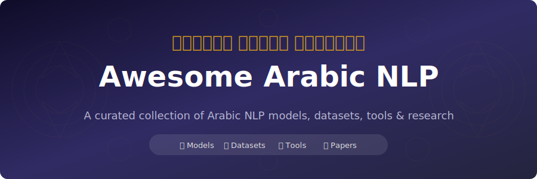

 
 

**The most comprehensive, up-to-date collection of Arabic NLP resources on the internet.** 
Models · Datasets · Tools · Research · Companies

---

## 📑 Table of Contents

<table>
<tr>
<td width="50%" valign="top">

- [🏢 Key Organizations](#-key-organizations)
- [🏆 Benchmarks & Leaderboards](#-benchmarks--leaderboards)
- [🤖 State-of-the-Art Models](#-state-of-the-art-models)
  - [💬 Large Language Models](#-large-language-models-llms)
  - [🌐 Multimodal Models](#-multimodal-models)
  - [🧠 Transformer-based Models](#-transformer-based-models)
  - [🔤 Embedding Models](#-embedding-models)
  - [🎯 Task-Specific Models](#-task-specific-models)
- [🎙️ Audio Models](#%EF%B8%8F-audio-models)
- [👁️ Vision Models](#%EF%B8%8F-vision-models)

</td>
<td width="50%" valign="top">

- [✏️ Diacritization (Tashkeel)](#%EF%B8%8F-diacritization-tashkeel)
- [🗣️ Dialect Identification](#%EF%B8%8F-dialect-identification)
- [📊 Key Datasets](#-key-datasets)
- [🔧 Essential Tools & Libraries](#-essential-tools--libraries)
- [📄 Research Papers & Conferences](#-research-papers--conferences)
- [🎓 Tutorials & Learning Resources](#-tutorials--learning-resources)
- [🏭 Companies & Startups](#-companies--startups)
- [📚 Awesome Lists](#-awesome-lists)

</td>
</tr>
</table>

---

## 🏢 Key Organizations

> Research labs and institutions driving Arabic NLP forward.

| Organization | Focus | Key Contributions | Link |
|:---|:---|:---|:---:|
| **AUB MIND Lab** | Foundational Arabic NLP models | AraBERT, AraGPT2, AraELECTRA |  |
| **CAMeL Lab, NYUAD** | Arabic NLP tools and models | CAMeLBERT, camel_tools |  |
| **UBC-NLP** | Dialectal Arabic, multimodal models | MARBERT, AraT5, NileChat, PEARL, Dallah |  |
| **QCRI** | Arabic LLMs, text processing | Fanar LLMs, AraDiCE, Farasa |  |
| **SILMA AI** | State-of-the-art Arabic LLMs | SILMA LLMs, Arabic Broad Benchmark |  |
| **MBZUAI** | Multimodal and speech models | AIN, ArTST, ClArTTS |  |
| **ARBML** | Democratizing Arabic NLP | masader, klaam, tkseem |  |
| **NAMAA-Space** | OCR and Egyptian Arabic models | Qari-OCR, EgypTalk-ASR |  |
| **Omartificial-Intelligence-Space** | Arabic embedding models | GATE, Matryoshka embeddings |  |
| **TII (Technology Innovation Institute)** | Arabic LLM benchmarks, Falcon | Open Arabic LLM Leaderboard, Falcon LLM |  |
| **SDAIA (Saudi Data & AI Authority)** | Sovereign Arabic LLM | ALLaM model |  |
| **SinaLab, Birzeit University** | Arabic NLP tools and datasets | SinaTools, Wojood NER |  |
| **G42 / Inception AI** | Arabic-centric LLMs | Jais LLM family |  |
| **FreedomIntelligence** | Arabic LLMs and alignment | AceGPT, Arabic cultural datasets |  |
| **Helsinki-NLP** | Machine translation models | OPUS-MT Arabic translation models |  |
| **LightOn AI** | Arabic web data | ArabicWeb24 corpus (39B+ tokens) |  |

<a href="#-table-of-contents">⬆ Back to Top</a>

---

## 🏆 Benchmarks & Leaderboards

> Standardized evaluation frameworks for Arabic language models.

| Benchmark | Description | Link |
|:---|:---|:---:|
| **MTEB Arabic Leaderboard** | Massive Text Embedding Benchmark for Arabic |  |
| **Arabic Broad Leaderboard (ABL)** | NextGen evaluation for Arabic LLMs by SILMA AI |  |
| **Open Arabic LLM Leaderboard** | Evaluation of Arabic LLMs across multiple benchmarks |  |
| **ALUE** | Arabic Language Understanding Evaluation benchmark |  |
| **BALSAM** | Benchmark of Arabic Language AI Systems and Models |  |
| **SILMA RAGQA Benchmark** | Evaluates Arabic/English LMs in Extractive QA tasks |  |
| **Arabic Broad Benchmark (ABB)** | Comprehensive evaluation tool for Arabic LLMs |  |
| **ArabicMMLU** | Multi-task language understanding from school exams |  |
| **GATmath and GATLc** | Benchmarks from Saudi GAT exams |  |
| **ArabicRAGB** | Arabic RAG Benchmark (multi-dialect) |  |
| **ACVA** | Arabic Cultural Value Alignment (8000+ questions, 58 areas) |  |

<a href="#-table-of-contents">⬆ Back to Top</a>

---

## 🤖 State-of-the-Art Models

### 💬 Large Language Models (LLMs)

> Arabic-centric and multilingual LLMs with strong Arabic capabilities.

| Model | Params | Developer | Key Features | Link |
|:---|:---:|:---|:---|:---:|
| **Jais** | 13B, 30B | Inception AI, Cerebras | Arabic-centric, bilingual, instruction-tuned |  |
| **SILMA 1.0** | 9B | SILMA AI | Top-ranked Arabic LLM built on Gemma |  |
| **ALLaM** | 7B | SDAIA & IBM | Saudi's sovereign model, enterprise-focused |  |
| **Fanar-1-9B** | 9B | QCRI | Arabic-English LLM |  |
| **AceGPT** | 7B | FreedomIntelligence | Top performance, culturally aligned |  |
| **Atlas-Chat** | 2B-27B | MBZUAI-Paris Lab | Moroccan Darija dialect |  |
| **NileChat-3B** | 3B | UBC-NLP | Egyptian and Moroccan dialects |  |
| **Nile-Chat** | 4B-12B | MBZUAI-Paris Lab | Egyptian Arabic and Arabizi scripts |  |
| **AraGPT2** | 1.5B | AUB MIND Lab | GPT-2 for Arabic text generation |  |
| **Command R7B Arabic** | 7B | Cohere | Arabic-optimized Command R variant |  |
| **SambaLingo-Arabic** | 7B, 70B | SambaNova | Arabic-adapted Llama 2 |  |
| **ArabianGPT** | - | - | Native Arabic GPT-based LLM |  |
| **Llama 3.3** | 70B | Meta | Strong Arabic performance |  |
| **Qwen 3** | 0.6B-235B | Alibaba | Multilingual with Arabic support |  |
| **Gemma 3** | 1B-27B | Google | Multimodal capabilities |  |
| **Cohere Command-A** | 111B | Cohere | Optimized for RAG |  |
| **Mistral Saba** | 24B | Mistral | Commercial API |  |

### 🌐 Multimodal Models

| Model | Params | Developer | Key Features | Link |
|:---|:---:|:---|:---|:---:|
| **AIN** | 8B | MBZUAI | Arabic-centric Large Multimodal Model |  |
| **Dallah** | - | UBC-NLP | Advanced multimodal LLM for Arabic |  |

### 🧠 Transformer-based Models

| Model | Developer | Key Features | Link |
|:---|:---|:---|:---:|
| **AraBERT** | AUB MIND Lab | First BERT for Arabic, multiple versions |  |
| **AraBERTv02** | AUB MIND Lab | Improved tokenization (135M params, 12M+ downloads) |  |
| **CAMeLBERT** | CAMeL Lab, NYUAD | MSA, Dialectal, and Classical Arabic |  |
| **MARBERT** | UBC-NLP | Focused on Dialectal Arabic and MSA |  |
| **MARBERTv2** | UBC-NLP | Updated with improved dialectal coverage |  |
| **AraELECTRA** | AUB MIND Lab | ELECTRA for Arabic |  |
| **AraT5** | UBC-NLP | T5 for Arabic summarization, translation, paraphrasing |  |

### 🔤 Embedding Models

| Model | Developer | Key Features | Link |
|:---|:---|:---|:---:|
| **GATE-AraBert-v1** | Omartificial-Intelligence-Space | SOTA on MTEB Arabic STS |  |
| **Arabic-Triplet-Matryoshka-V2** | Omartificial-Intelligence-Space | Matryoshka representation |  |
| **Swan** | UBC-NLP | Dialect-aware, cross-lingual |  |
| **asafaya/bert-base-arabic** | asafaya | BERT-based Arabic embeddings |  |
| **ModernBERT-Arabic** | BounharAbdelaziz | ModernBERT-based sentence embeddings |  |
| **DIMI-embedding** | AhmedZaky1 | Matryoshka + AraBERT for NLI |  |

### 🎯 Task-Specific Models

| Model | Task | Key Features | Link |
|:---|:---|:---|:---:|
| **CAMeLBERT-MSA-Sentiment** | Sentiment Analysis | Fine-tuned for MSA sentiment |  |
| **t5-arabic-summarization** | Summarization | T5 for Arabic news summarization |  |
| **opus-mt-en-ar** | Translation EN→AR | Helsinki-NLP (3.5M+ downloads) |  |
| **opus-mt-ar-en** | Translation AR→EN | Helsinki-NLP (12.4M+ downloads) |  |
| **arabic-gec-v1** | Grammar Correction | Gemma-3-1b for Arabic GEC |  |
| **Arabic-Text-Correction** | Text Correction | AraT5-based text correction |  |
| **arat5-dialects-translation** | Dialect→MSA | AraT5 dialect translation |  |

<a href="#-table-of-contents">⬆ Back to Top</a>

---

## 🎙️ Audio Models

### 🗣️ Speech Recognition (ASR)

| Model | Key Features | Link |
|:---|:---|:---:|
| **openai/whisper-large-v3** | Supports Arabic among many languages |  |
| **MasriSwitch-Gemma3n** | Egyptian Arabic code-switching transcription |  |
| **wav2vec2-large-xlsr-53-arabic** | Fine-tuned on Common Voice & Arabic Speech Corpus |  |
| **artst_asr_v3** | ArTST for ASR on MGB2 (best for MSA) |  |
| **EgypTalk-ASR-v2** | High-performance ASR for Egyptian Arabic |  |

### 🔊 Text-to-Speech (TTS)

| Model | Key Features | Link |
|:---|:---|:---:|
| **facebook/mms-tts-ara** | Facebook's Massively Multilingual Speech |  |
| **speecht5_tts_clartts_ar** | SpeechT5 for Classical Arabic TTS |  |
| **F5-TTS-Arabic** | F5-TTS with regional diversity |  |

<a href="#-table-of-contents">⬆ Back to Top</a>

---

## 👁️ Vision Models

### 📖 Optical Character Recognition (OCR)

| Model | Key Features | Link |
|:---|:---|:---:|
| **Qari-OCR-0.1-VL-2B-Instruct** | Qwen2 VL 2B fine-tuned for Arabic OCR |  |
| **arabic-large-nougat** | End-to-end structured OCR for Arabic |  |

### 🖼️ Image Captioning

| Model | Key Features | Link |
|:---|:---|:---:|
| **blip-Arabic-flickr-8k** | BLIP fine-tuned for Arabic image captioning |  |

<a href="#-table-of-contents">⬆ Back to Top</a>

---

## ✏️ Diacritization (Tashkeel)

> Models and tools for adding harakat (حركات) to Arabic text.

### Models

| Model / System | Key Features | Link |
|:---|:---|:---:|
| **CATT** | Character-based Tashkeel Transformer, SOTA results |  |
| **Fine-Tashkeel** | Fine-tuned ByT5, 40% WER reduction |  |
| **Sadeed** | Small language model for diacritization |  |
| **Shakkala** | Neural vocalization using bidirectional LSTM |  |
| **Mishkal** | Rule-based diacritizer with dictionary lookups |  |

### Datasets

| Dataset | Description | Link |
|:---|:---|:---:|
| **Tashkeela** | Arabic diacritization corpus |  |
| **arabic-text-diacritization** | Benchmark dataset with systems comparison |  |

<a href="#-table-of-contents">⬆ Back to Top</a>

---

## 🗣️ Dialect Identification

> Resources for identifying and classifying Arabic dialects.

### Shared Tasks

| Task | Description | Link |
|:---|:---|:---:|
| **NADI 2025** | Multidialectal Arabic Speech Processing (8-way dialect + ASR) |  |
| **NADI 2024** | Fifth Nuanced Arabic Dialect Identification |  |
| **NADI Shared Tasks** | Ongoing series of Arabic DID shared tasks |  |

### Datasets

| Dataset | Description | Link |
|:---|:---|:---:|
| **QADI** | Twitter-based multi-class dialect classification |  |
| **Arabic POS Dialect** | POS tagging in Arabic dialects |  |
| **Arabic Dialects to MSA** | Parallel dialect-MSA corpus |  |
| **Casablanca** | Multidialectal Arabic speech dataset (NADI 2025) |  |

<a href="#-table-of-contents">⬆ Back to Top</a>

---

## 📊 Key Datasets

### 📝 Text Datasets

| Dataset | Description | Link |
|:---|:---|:---:|
| **masader** | Largest public catalogue of Arabic NLP datasets (600+) |  |
| **101 Billion Arabic Words** | Massive Arabic web corpus |  |
| **ArabicWeb24** | 39B+ tokens of high-quality Arabic web content |  |
| **ArabicText-Large** | 743K articles for LLM training |  |
| **Arabic Billion Words** | Abu El-Khair corpus: 5M+ articles, 1.5B+ words |  |
| **Arabic Tweets** | 41GB+ of Arabic tweets (~4B words) |  |
| **Wojood** | Nested NER corpus (550K tokens) |  |
| **CIDAR** | Culturally relevant instruction dataset (10K pairs) |  |
| **Arabic_Function_Calling** | First Arabic function calling dataset (50K+ samples) |  |
| **ArabicaQA** | Large-scale Arabic Question Answering |  |
| **Mixed Arabic Datasets (MAD)** | Community-driven diverse Arabic texts |  |
| **Arabic-OpenHermes-2.5** | Arabic OpenHermes instruction dataset |  |
| **Alpaca Arabic Instruct** | Arabic Alpaca instruction dataset |  |
| **Rasaif** | Classical Arabic-English parallel texts (24 books) |  |
| **Shifaa Medical** | Arabic medical consultation dataset |  |
| **Shifaa Mental Health** | Arabic mental health consultations |  |
| **Arabic Reasoning Dataset** | 9.2K instruction-based reasoning QA pairs |  |
| **Gazelle** | Arabic writing assistance dataset |  |
| **arabic-hate-speech-superset** | Comprehensive hate speech detection |  |
| **ArabicCorpus2B** | 1.9B word Arabic corpus |  |
| **The Arabic E-Book Corpus** | 1,745 books (81.5M words) |  |
| **BAREC Corpus** | Arabic Readability Assessment |  |
| **palm** | Human-created Arabic instruction dataset |  |
| **dialogue-arabic-dialects** | Levantine, Egyptian, Gulf dialect dialogues |  |

### 🎤 Speech Datasets

| Dataset | Description | Link |
|:---|:---|:---:|
| **ClArTTS** | Classical Arabic TTS dataset |  |
| **Arabic Speech Corpus** | South Levantine Arabic (Damascian accent) |  |
| **Arabic-English Code-Switching** | Code-switching speech from YouTube |  |
| **Egyptian Arabic ASR Clean** | ~72 hours of Egyptian Arabic speech |  |
| **MADIS5** | Spoken Arabic dialects |  |
| **SADA22** | MSA and Khaliji speech |  |
| **SawtArabi** | Arabic speech dataset |  |

### 🖼️ Vision & Multimodal Datasets

| Dataset | Description | Link |
|:---|:---|:---:|
| **PEARL** | Multimodal Culturally-Aware Arabic Instruction Dataset |  |
| **Arabic-Image-Captioning_100M** | 100 million Arabic image captions |  |
| **Calliar** | Online Arabic calligraphy (2500 samples) |  |
| **arabic-img2md** | 15K PDF pages paired with Markdown |  |
| **Arabic-OCR-Dataset** | 1M+ Arabic OCR samples |  |
| **Arabic-VLM-Full-Pearl** | 309K multimodal examples for VLM training |  |

<a href="#-table-of-contents">⬆ Back to Top</a>

---

## 🔧 Essential Tools & Libraries

### ⚙️ Toolkits & Preprocessing

| Tool | Description | Link |
|:---|:---|:---:|
| **camel_tools** | Suite of Arabic NLP tools (morphology, POS, NER, etc.) |  |
| **Farasa** | Fast and accurate Arabic text processing toolkit |  |
| **SinaTools** | Open source toolkit by SinaLab (Python APIs, CLI) |  |
| **Qalsadi** | Arabic morphological analyzer and lemmatizer |  |
| **PyArabic** | Python package for Arabic text manipulation |  |
| **tnkeeh** | Arabic text cleaning, normalization, preprocessing |  |
| **Maha** | Text processing library for Arabic text |  |
| **Mishkal** | Arabic text diacritizer (rule-based) |  |
| **arabicprocess** | Python library for Arabic preprocessing |  |
| **MADAMIRA** | Morphological analysis, diacritization, POS tagging |  |

### 📚 Specialized Libraries

| Library | Task | Link |
|:---|:---|:---:|
| **klaam** | Speech Recognition, Classification, TTS |  |
| **tkseem** | Arabic Tokenization |  |
| **arabic-stop-words** | Largest list of Arabic stop words |  |
| **qawafi** | Arabic poetry analysis |  |
| **arabic_vocalizer** | Deep-learning diacritization (ONNX format) |  |

### 🌍 Translation

| Tool | Description | Link |
|:---|:---|:---:|
| **opus-mt-en-ar** | English → Arabic neural MT |  |
| **opus-mt-ar-en** | Arabic → English neural MT (12.4M+ downloads) |  |

<a href="#-table-of-contents">⬆ Back to Top</a>

---

## 📄 Research Papers & Conferences

### 🎤 Conferences & Workshops

| Conference | Year | Link |
|:---|:---:|:---:|
| **ArabicNLP 2025** | 2025 |  |
| **ArabicNLP 2024** | 2024 |  |
| **ArabicNLP 2023** | 2023 |  |
| **Arabic NLP Winter School** | 2025 |  |
| **AbjadNLP Workshop** | 2025-2026 |  |
| **OSACT** | Ongoing |  |

### 📖 Foundational & Survey Papers

1. **The Landscape of Arabic Large Language Models** (2025) [[1]](#references)
2. **AraBERT: Transformer-based Model for Arabic Language Understanding** (Antoun et al., 2020) [[2]](#references)
3. **The Interplay of Variant, Size, and Task Type in Arabic Pre-trained Language Models** (Inoue et al., 2021) [[3]](#references)
4. **ARBERT & MARBERT: Deep Bidirectional Transformers for Arabic** (Abdul-Mageed et al., 2021) [[4]](#references)
5. **Jais and Jais-chat: Arabic-Centric Foundation and Instruction-Tuned LLMs** (Sengupta et al., 2023) [[5]](#references)
6. **Wojood: Nested Arabic Named Entity Corpus and Recognition** (Jarrar et al., 2022) [[6]](#references)
7. **Deep Learning for Arabic NLP: A Survey** (Al-Ayyoub et al., 2018) [[7]](#references)
8. **Evaluating Arabic LLMs: A Survey of Benchmarks, Methods, and Gaps** (Alzubaidi et al., 2025) [[8]](#references)

### 🆕 Recent Papers (2024-2025)

- **Swan and ArabicMTEB** — Dialect-Aware, Cross-Lingual Language Understanding (Bhatia et al., 2024) [[9]](#references)
- **GATE** — General Arabic Text Embedding for Enhanced STS (Nacar et al., 2025) [[10]](#references)
- **A Survey of LLMs for Arabic Language and its Dialects** (Mashaabi et al., 2024) [[11]](#references)
- **Hate speech detection in Arabic** — corpus design and evaluation (2024) [[12]](#references)
- **NADI 2024** — Fifth Nuanced Arabic Dialect Identification Shared Task (2024) [[13]](#references)
- **CATT** — Character-based Arabic Tashkeel Transformer (2024) [[14]](#references)
- **ArabianGPT** — Native Arabic GPT-based LLM (2024) [[15]](#references)
- **SambaLingo** — Teaching LLMs New Languages (2024) [[16]](#references)

<a href="#-table-of-contents">⬆ Back to Top</a>

---

## 🎓 Tutorials & Learning Resources

### 🏫 Academic Programs

| Resource | Description | Link |
|:---|:---|:---:|
| **Arabic NLP Winter School** | Two-day intensive at MBZUAI (Jan 2025) |  |
| **ArabicNLP Conference** | Annual ACL-affiliated conference by SIGARAB |  |
| **AbjadNLP Workshop** | NLP for languages using Arabic script |  |

### 💻 Online Resources

| Resource | Description | Link |
|:---|:---|:---:|
| **Hugging Face NLP Course** | Free NLP course (applicable to Arabic models) |  |
| **AUB MIND Lab Arabic-NLP Demo** | Interactive demo for Arabic NLP tasks |  |
| **MoroccoAI Darija Resources** | Curated Moroccan Arabic dialect NLP resources |  |
| **NNLP-IL Arabic Resources** | Comprehensive Arabic NLP resource list |  |

<a href="#-table-of-contents">⬆ Back to Top</a>

---

## 🏭 Companies & Startups

> Companies and organizations building Arabic AI/NLP products and services.

### 🇦🇪 United Arab Emirates

| Company | Focus | Notable Products | Link |
|:---|:---|:---|:---:|
| **G42** | AI holding company, Arabic LLMs | Jais LLM, enterprise AI solutions |  |
| **Inception AI** | Arabic-centric foundation models | Jais model family (with Cerebras) |  |
| **Technology Innovation Institute (TII)** | Open-source LLMs, research | Falcon LLM family |  |
| **Saal.ai** | Cognitive AI solutions | Arabic NLP, speech, generative AI |  |
| **Arabot** | Conversational AI for Arabic | Arabic NLP chatbot engine |  |
| **Arabic.AI (Tarjama)** | Arabic-first autonomous AI | Pronoia Arabic LLM, Agentic AI platform |  |
| **DXwand** | AI-powered chatbots and analytics | ORXTRA platform, Arabic/English NLU |  |

### 🇸🇦 Saudi Arabia

| Company | Focus | Notable Products | Link |
|:---|:---|:---|:---:|
| **SDAIA** | Sovereign AI, national data authority | ALLaM model, HUMAIN initiative |  |
| **Future Look ITC (FLITC)** | Arabic-native AI solutions, venture studio | LABEAH, Smart Hire, Rayee Media, Nabadat |  |
| **Wittify.ai** | Conversational AI for Arabic | Interactive Arabic AI agents |  |
| **Lucidya** | AI customer experience analytics | Arabic social listening, sentiment analysis |  |

### 🇪🇬 Egypt

| Company | Focus | Notable Products | Link |
|:---|:---|:---|:---:|
| **Velents** | Enterprise Arabic AI solutions | Agent.sa (Arabic-speaking AI employee) |  |

### 🌍 International (with Arabic focus)

| Company | Country | Focus | Notable Products | Link |
|:---|:---|:---|:---|:---:|
| **SILMA AI** | - | Arabic-first LLMs | SILMA LLMs, Arabic Broad Benchmark |  |
| **Cohere** | Canada | Multilingual LLMs | Command R Arabic, RAG optimization |  |
| **Mistral AI** | France | Multilingual LLMs | Mistral Saba (Arabic-optimized) |  |
| **SambaNova Systems** | USA | Arabic language adaptation | SambaLingo Arabic models |  |

<a href="#-table-of-contents">⬆ Back to Top</a>

---

## 📚 Awesome Lists

| List | Description |
|:---|:---|
| [01walid/awesome-arabic](https://github.com/01walid/awesome-arabic) | Awesome projects, libraries, and resources for Arabic |
| [Curated-Awesome-Lists/awesome-arabic-nlp](https://github.com/Curated-Awesome-Lists/awesome-arabic-nlp) | Comprehensive Arabic NLP resources |
| [MoroccoAI/Arabic-Darija-NLP-Resources](https://github.com/MoroccoAI/Arabic-Darija-NLP-Resources) | Moroccan Arabic dialect NLP resources |
| [NNLP-IL/Arabic-Resources](https://github.com/NNLP-IL/Arabic-Resources) | Comprehensive Arabic NLP resource list |

<a href="#-table-of-contents">⬆ Back to Top</a>

---

## 🤝 Contributing

Contributions are welcome! Please open an issue or submit a pull request to add new resources or update existing ones.

1. Fork the repository
2. Add your resource in the appropriate section
3. Ensure links are valid and descriptions are concise
4. Submit a pull request

---

## 📜 License

This work is licensed under a [Creative Commons Attribution 4.0 International License](https://creativecommons.org/licenses/by/4.0/).

---

## 📑 References

[1] The Landscape of Arabic Large Language Models. (2025). *arXiv preprint arXiv:2506.01340*. https://arxiv.org/html/2506.01340v1

[2] Antoun, W., Baly, F., & Hajj, H. (2020). AraBERT: Transformer-based Model for Arabic Language Understanding. *OSACT*. https://aclanthology.org/2020.osact-1.2/

[3] Inoue, G., et al. (2021). The Interplay of Variant, Size, and Task Type in Arabic Pre-trained Language Models. *WANLP*. https://aclanthology.org/2021.wanlp-1.10/

[4] Abdul-Mageed, M., et al. (2021). ARBERT & MARBERT: Deep Bidirectional Transformers for Arabic. *ACL*. https://aclanthology.org/2021.acl-long.551/

[5] Sengupta, N., et al. (2023). Jais and Jais-chat. *arXiv:2308.16149*. https://arxiv.org/abs/2308.16149

[6] Jarrar, M., et al. (2022). Wojood: Nested Arabic Named Entity Corpus. *arXiv:2205.09651*. https://arxiv.org/abs/2205.09651

[7] Al-Ayyoub, M., et al. (2018). Deep learning for Arabic NLP: A survey. *Journal of Computational Science*, 26. https://www.sciencedirect.com/science/article/pii/S1877750317303757

[8] Alzubaidi, A., et al. (2025). Evaluating Arabic LLMs: Benchmarks, Methods, and Gaps. *arXiv:2510.13430*. https://arxiv.org/abs/2510.13430

[9] Bhatia, G., et al. (2024). Swan and ArabicMTEB. *arXiv:2411.01192*. https://arxiv.org/abs/2411.01192

[10] Nacar, O., et al. (2025). GATE: General Arabic Text Embedding. *arXiv:2505.24581*. https://arxiv.org/abs/2505.24581

[11] Mashaabi, M., et al. (2024). A Survey of LLMs for Arabic. *arXiv:2410.20238*. https://arxiv.org/abs/2410.20238

[12] Hate speech detection in Arabic. (2024). *Frontiers in AI*. https://www.frontiersin.org/journals/artificial-intelligence/articles/10.3389/frai.2024.1345445/full

[13] NADI 2024: Fifth Nuanced Arabic Dialect Identification. (2024). *ArabicNLP*. https://arxiv.org/abs/2407.04910

[14] CATT: Character-based Arabic Tashkeel Transformer. (2024). *arXiv:2407.03236*. https://arxiv.org/abs/2407.03236

[15] ArabianGPT: Native Arabic GPT-based LLM. (2024). *arXiv:2402.15313*. https://arxiv.org/abs/2402.15313

[16] SambaLingo: Teaching LLMs New Languages. (2024). *arXiv:2404.05829*. https://arxiv.org/abs/2404.05829

---

**If you find this resource helpful, please give it a ⭐**

Made with ❤️ for the Arabic NLP community

